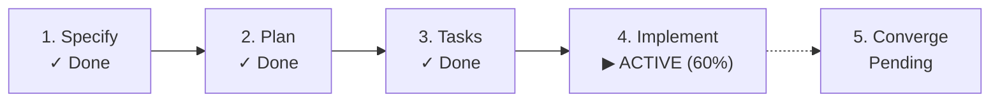

# SpecKitPlus: SDLC Lifecycle State Tracker

[](CHANGELOG.md)
[](LICENSE)
[-success.svg)](scripts/lifecycle-engine.py)
[](extension.yml)

> **A zero-dependency Spec Kit extension that turns every specification, bug, and product assessment into a self-documenting, living state artifact.**

Spec Kit organizes software delivery into rigorous markdown artifacts (`spec.md`, `plan.md`, `tasks.md`). But knowing where an item stands, how long milestones took, whether a mid-flight agent crashed, or what command to run next often requires manual inspection.

**SpecKitPlus** acts as a non-intrusive **State Keeper**: it records execution history, passively senses manual edits, detects interruptions, and highlights the next recommended step—all persisted directly into the repository filesystem.

---

## The Philosophy: State Keeper, Never an Enforcer

Traditional workflow tools block developers when steps happen out of order. SpecKitPlus never halts execution or rejects non-standard paths. Instead, it observes reality:
- **Descriptive, not prescriptive**: If you skip clarification or jump straight to implementation, it records what actually happened and generates an *Observed Deviation* explanation.
- **Non-destructive layering**: Editing an upstream specification increments revision counts and raises a *Soft Drift Advisory* without wiping out downstream tasks.
- **Filesystem encapsulation**: State lives inside each item's directory (`lifecycle.md`), keeping the root clean and the global overview (`.specify/lifecycle-overview.md`) bloat-free.

---

## Architecture: Dual-Engine Design

```mermaid
graph TD
    subgraph Active["Active Engine (Spec Kit Hooks)"]
        Pre["Pre-Command Hook"] --> Start["Record IN_PROGRESS & Started Timestamp"]
        Post["Post-Command Hook"] --> Complete["Record COMPLETED, Duration & Exit Code"]
    end

    subgraph Passive["Passive Engine (Artifact Sensing)"]
        FileMod["Manual / Conversational Edits"] --> Sense["Timestamp & Hash Scanner"]
        Tasks["tasks.md Checkboxes"] --> Prog["Real-Time Completion %"]
    end

    subgraph Core["Lifecycle Engine (Python 3 stdlib)"]
        Start --> Core
        Complete --> Core
        Sense --> Core
        Prog --> Core
        Core --> LivingDoc["Living Artifact (specs/<slug>/lifecycle.md)"]
        Core --> Overview["Repository Dashboard (.specify/lifecycle-overview.md)"]
    end
```

1. **Active Engine**: Intercepts Spec Kit commands (`specify`, `plan`, `tasks`, `implement`, `converge`, plus bug and assessment tracks) to log start/end timestamps, elapsed durations, and exit codes.
2. **Passive Engine**: Inspects filesystem mtimes to detect conversational edits in chat or IDEs without slash commands, and calculates live `- [x]` completion ratios from `tasks.md`.
3. **State Reconciliation**: If a `lifecycle.md` is deleted or pre-dates extension installation, scanning existing artifacts (`spec.md`, `plan.md`, `tasks.md`, `checklists/`) automatically reconstructs the full milestone timeline.

---

## Quickstart

### Installation

```bash
# In your target project (from community catalog):
specify extension add lifecycle

# Or from local source during development:
specify extension add /path/to/speckitplus --dev
```

### Day-to-Day Workflow

Once installed, tracking is automatic. You can inspect status anytime:

```bash
# Check current feature status & next recommended action:
/speckit-lifecycle-status

# View repository-wide SDLC dashboard:
/speckit-lifecycle-overview
```

Or invoke the engine CLI directly:

```bash
./scripts/lifecycle-engine.py status [--json] [--dir <path>]
./scripts/lifecycle-engine.py overview [--all] [--json]
./scripts/lifecycle-engine.py reconcile [dir]
```

---

## Anatomy of `lifecycle.md`

Each managed item receives a hybrid `lifecycle.md` document combining machine-actionable YAML frontmatter with human-readable GitHub Flavored Markdown:

```markdown
---
track: feature
slug: 001-user-auth
title: User Authentication
current_phase: IMPLEMENTING
sub_status: active
revision_count: 1
next_action:
  command: /speckit-implement
  description: Continue implementation tasks (60% complete)
progress:
  tasks_total: 10
  tasks_completed: 6
  percent: 60
drift_advisory: null
deviation_explanation: null
created_at: "2026-09-02T10:00:00Z"
updated_at: "2026-09-02T10:45:00Z"
transitions:
  - id: evt-001
    phase: SPECIFIED
    command: speckit.specify
    status: COMPLETED
    started_at: "2026-09-02T10:00:00Z"
    completed_at: "2026-09-02T10:02:30Z"
    duration_seconds: 150
---

# SDLC Lifecycle: User Authentication
**Track**: Feature | **Current Phase**: `IMPLEMENTING` | **Status**: `ACTIVE`

> [!TIP]
> **Next Recommended Action**: `/speckit-implement`  
> *Continue implementation tasks (60% complete)*



## Milestone Timeline

| Phase | Command | Status | Started | Completed | Duration | Notes |
|---|---|---|---|---|---|---|
| SPECIFIED | speckit.specify | COMPLETED | 10:00:00 | 10:02:30 | 2m 30s | Initial specification |
| PLANNED | speckit.plan | COMPLETED | 10:15:00 | 10:20:00 | 5m 00s | Architecture approved |
| TASKED | speckit.tasks | COMPLETED | 10:25:00 | 10:28:00 | 3m 00s | 10 tasks generated |
| IMPLEMENTING | speckit.implement | IN_PROGRESS | 10:30:00 | - | - | 6/10 tasks completed |
```

---

## Key Capabilities

- **Crash & Interruption Recovery**: Pre-hooks log `status: IN_PROGRESS`. If an agent or session halts unexpectedly, the next query flags the event as `INTERRUPTED` and presents clean resumption guidance.
- **Multi-Track Support**: Native lifecycle taxonomies for **Features** (`SPECIFIED` &rarr; `CONVERGED`), **Bug Triage** (`ASSESSED` &rarr; `VERIFIED` or `ESCALATED_TO_FEATURE`), and **Idea Assessments** (`INTAKE` &rarr; `DECIDED_GO` / `DECIDED_KILL`).
- **Soft Drift Advisories**: Upstream edits increment revisions and flag drift between artifacts without destroying downstream implementation files.
- **Task Checkbox Synchronization**: Scans `- [ ]` / `- [x]` items dynamically on every run to keep progress percentages accurate.
- **Zero Dependencies**: Pure Python 3 standard library (`json`, `pathlib`, `argparse`, `datetime`) and POSIX bash. No virtual environments, pip packages, or npm modules required.

---

## Configuration

Optionally configure extension behavior in `.specify/lifecycle.config.yml` (scaffolded from [`config-template.yml`](config-template.yml)):

```yaml
passive_sensing:
  enabled: true
  drift_threshold_seconds: 60  # Grace period to prevent false drift on multi-file saves
overview:
  path: ".specify/lifecycle-overview.md"
  auto_refresh: true
  include_completed: false
interruption_detection:
  enabled: true
format:
  render_mermaid: true
```

---

## Verification & Testing

The extension includes a complete automated test suite (contract tests, schema validators, and POSIX integration suites):

```bash
./tests/run_all_tests.sh
```

---

## License

This project is licensed under the [MIT License](LICENSE).
