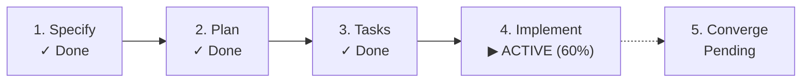

# SpecKitPlus: SDLC Lifecycle State Tracker

[](CHANGELOG.md)
[](LICENSE)
[-success.svg)](scripts/lifecycle-engine.py)
[](extension.yml)

> **A zero-dependency Spec Kit extension that turns every specification, bug, and product assessment into a self-documenting, living state artifact.**

Spec Kit organizes software delivery into rigorous markdown artifacts (`spec.md`, `plan.md`, `tasks.md`). But knowing where an item stands, how long milestones took, whether a mid-flight agent crashed, or what command to run next often requires manual inspection.

**SpecKitPlus** acts as a non-intrusive **State Keeper**: it records execution history, passively senses manual edits, detects interruptions, and highlights the next recommended step—all persisted directly into the repository filesystem.

---

## The Philosophy: State Keeper, Never an Enforcer

Traditional workflow tools block developers when steps happen out of order. SpecKitPlus never halts execution or rejects non-standard paths. Instead, it observes reality:
- **Descriptive, not prescriptive**: If you skip clarification or jump straight to implementation, it records what actually happened and generates an *Observed Deviation* explanation.
- **Non-destructive layering**: Editing an upstream specification increments revision counts and raises a *Soft Drift Advisory* without wiping out downstream tasks.
- **Filesystem encapsulation**: State lives inside each item's directory (`lifecycle.md`), keeping the root clean and the global overview (`.specify/lifecycle-overview.md`) bloat-free.

---

## Architecture: Dual-Engine Design

```mermaid
graph TD
    subgraph Active["Active Engine (Spec Kit Hooks)"]
        Pre["Pre-Command Hook"] --> Start["Record IN_PROGRESS & Started Timestamp"]
        Post["Post-Command Hook"] --> Complete["Record COMPLETED, Duration & Exit Code"]
    end

    subgraph Passive["Passive Engine (Artifact Sensing)"]
        FileMod["Manual / Conversational Edits"] --> Sense["Timestamp & Hash Scanner"]
        Tasks["tasks.md Checkboxes"] --> Prog["Real-Time Completion %"]
    end

    subgraph Core["Lifecycle Engine (Python 3 stdlib)"]
        Start --> Core
        Complete --> Core
        Sense --> Core
        Prog --> Core
        Core --> LivingDoc["Living Artifact (specs/<slug>/lifecycle.md)"]
        Core --> Overview["Repository Dashboard (.specify/lifecycle-overview.md)"]
    end
```

1. **Active Engine**: Intercepts Spec Kit commands (`specify`, `plan`, `tasks`, `implement`, `converge`, plus bug and assessment tracks) to log start/end timestamps, elapsed durations, and exit codes.
2. **Passive Engine**: Inspects filesystem mtimes to detect conversational edits in chat or IDEs without slash commands, and calculates live `- [x]` completion ratios from `tasks.md`.
3. **State Reconciliation**: If a `lifecycle.md` is deleted or pre-dates extension installation, scanning existing artifacts (`spec.md`, `plan.md`, `tasks.md`, `checklists/`) automatically reconstructs the full milestone timeline.

---

## Installation & Verification

### Prerequisites
- [Spec Kit](https://github.com/github/spec-kit) CLI (`specify`) installed and initialized in your repository (`specify init`).
- Python 3.10+ (standard library only; no pip packages or virtual environments needed).

### Step 1: Install the Extension

Choose the method that matches your setup:

```bash
# Method A: From the Spec Kit community catalog (recommended once published)
specify extension add lifecycle

# Method B: Direct from GitHub release archive
specify extension add lifecycle --from https://github.com/k-electron/speckitplus/archive/refs/tags/v1.0.0.zip

# Method C: From a local clone or development branch
specify extension add /path/to/speckitplus --dev
```

### Step 2: Verify Installation

Confirm that the extension and its commands are registered:

```bash
specify extension list
```

You should see:
```text
✓ SDLC Lifecycle State Tracker (v1.0.0)
   lifecycle
   Living SDLC state artifact tracker and workspace overview
   Commands: 2 | Hooks: Active | Status: Enabled
```

---

## Step-by-Step Usage Walkthrough

Once installed, **you don't need to change how you work**. SpecKitPlus runs silently in the background via Spec Kit hooks.

### 1. Start a Feature as Usual

Invoke the standard Spec Kit command in your agent or terminal:

```bash
/speckit-specify "Build modern user notifications"
```

**What happens automatically**:
- The pre-hook intercepts the command and records an `IN_PROGRESS` transition.
- Upon completion, `specs/002-build-user-notifications/lifecycle.md` is born with phase `SPECIFIED` and exact execution timestamps.

### 2. Check "What Do I Run Next?"

Any developer or AI agent can query the current item's health and next milestone:

```bash
/speckit-lifecycle-status
```

Output:
```text
SDLC Status:   Build Modern User Notifications (002-build-user-notifications)
Track:         Feature
Current Phase: SPECIFIED
Status:        ACTIVE
Next Action:   /speckit-plan (Create architecture and implementation plan)
Progress:      0% (0/0 tasks)
Last Updated:  2026-09-02T10:05:00Z
```

### 3. Move Through the SDLC

Follow the recommended actions:
1. Run `/speckit-plan` &rarr; `lifecycle.md` updates to `PLANNED`; next action becomes `/speckit-tasks`.
2. Run `/speckit-tasks` &rarr; `lifecycle.md` updates to `TASKED`; next action becomes `/speckit-implement`.
3. Run `/speckit-implement` &rarr; `lifecycle.md` tracks real-time progress:

```text
SDLC Status:   Build Modern User Notifications (002-build-user-notifications)
Current Phase: IMPLEMENTING
Status:        ACTIVE
Next Action:   /speckit-implement (Continue implementation tasks (60% complete))
Progress:      60% (6/10 tasks)
```

As tasks in `tasks.md` are marked `[x]`, progress updates dynamically on every invocation.

### 4. View the Team Dashboard

Compile or view repository-wide progress across all features, bugs, and idea assessments:

```bash
/speckit-lifecycle-overview
```

This compiles a clean markdown dashboard saved to [`.specify/lifecycle-overview.md`](config-template.yml):

```markdown
# Repository SDLC Overview

| Track | Active Items | Completed Items |
|---|---|---|
| **Features** | 2 | 5 |
| **Bugs** | 1 | 3 |
| **Assessments** | 0 | 2 |

## Active Work

| Slug | Track | Current Phase | Progress | Next Recommended Action | Last Updated |
|---|---|---|---|---|---|
| 002-build-user-notifications | Feature | IMPLEMENTING | 60% (6/10) | `/speckit-implement` | 2026-09-02 10:45 |
| bug-041-token-expiry | Bug | ASSESSED | 0% (0/0) | `/speckit-bug-fix` | 2026-09-02 09:30 |
```

---

## Real-World Scenarios & Edge Cases

### Resuming an Interrupted or Crashed Agent Run
If an AI coding agent session crashes, terminal times out, or process halts mid-execution:
- Run `/speckit-lifecycle-status`.
- The State Keeper detects the unclosed `IN_PROGRESS` event, flags `Status: INTERRUPTED`, logs how long the session ran before aborting, and gives you the exact command to resume without losing already-completed tasks.

### Non-Destructive Soft Drift (Editing Specs Out-of-Band)
If you refine `spec.md` or `plan.md` in your IDE or conversational chat *after* tasks are generated:
- SpecKitPlus senses the filesystem timestamp difference on the next run.
- It marks the milestone as `PLANNED (revised)`, increments `revision_count: 2`, and raises a non-blocking `Drift Notice`.
- **Downstream work is never deleted**—your existing `tasks.md` and code remain intact.

### Adopting in Existing Projects (State Reconciliation)
If you install SpecKitPlus in a project with pre-existing features that lack a `lifecycle.md`:
- Running `/speckit-lifecycle-status` or `./scripts/lifecycle-engine.py reconcile` inspects the directory's existing files (`spec.md`, `plan.md`, `tasks.md`, `checklists/`).
- It automatically determines the active phase (100% accuracy) and reconstructs a valid `lifecycle.md` with milestone history.

---

## CLI & Direct Engine Usage

The Python engine can also be executed directly in CI pipelines or terminal scripts without Spec Kit slash commands:

```bash
# Query active status (or target a specific directory):
./scripts/lifecycle-engine.py status [--dir specs/001-feature] [--json]

# Compile repository overview (or emit JSON for dashboards):
./scripts/lifecycle-engine.py overview [--all] [--json]

# Reconstruct / reconcile a missing lifecycle.md:
./scripts/lifecycle-engine.py reconcile specs/001-feature [--json]
```

---

## Anatomy of `lifecycle.md`

Each managed item receives a hybrid `lifecycle.md` document combining machine-actionable YAML frontmatter with human-readable GitHub Flavored Markdown:

```markdown
---
track: feature
slug: 001-user-auth
title: User Authentication
current_phase: IMPLEMENTING
sub_status: active
revision_count: 1
next_action:
  command: /speckit-implement
  description: Continue implementation tasks (60% complete)
progress:
  tasks_total: 10
  tasks_completed: 6
  percent: 60
drift_advisory: null
deviation_explanation: null
created_at: "2026-09-02T10:00:00Z"
updated_at: "2026-09-02T10:45:00Z"
transitions:
  - id: evt-001
    phase: SPECIFIED
    command: speckit.specify
    status: COMPLETED
    started_at: "2026-09-02T10:00:00Z"
    completed_at: "2026-09-02T10:02:30Z"
    duration_seconds: 150
---

# SDLC Lifecycle: User Authentication
**Track**: Feature | **Current Phase**: `IMPLEMENTING` | **Status**: `ACTIVE`

> [!TIP]
> **Next Recommended Action**: `/speckit-implement`  
> *Continue implementation tasks (60% complete)*



## Milestone Timeline

| Phase | Command | Status | Started | Completed | Duration | Notes |
|---|---|---|---|---|---|---|
| SPECIFIED | speckit.specify | COMPLETED | 10:00:00 | 10:02:30 | 2m 30s | Initial specification |
| PLANNED | speckit.plan | COMPLETED | 10:15:00 | 10:20:00 | 5m 00s | Architecture approved |
| TASKED | speckit.tasks | COMPLETED | 10:25:00 | 10:28:00 | 3m 00s | 10 tasks generated |
| IMPLEMENTING | speckit.implement | IN_PROGRESS | 10:30:00 | - | - | 6/10 tasks completed |
```

---

## Key Capabilities

- **Crash & Interruption Recovery**: Pre-hooks log `status: IN_PROGRESS`. If an agent or session halts unexpectedly, the next query flags the event as `INTERRUPTED` and presents clean resumption guidance.
- **Multi-Track Support**: Native lifecycle taxonomies for **Features** (`SPECIFIED` &rarr; `CONVERGED`), **Bug Triage** (`ASSESSED` &rarr; `VERIFIED` or `ESCALATED_TO_FEATURE`), and **Idea Assessments** (`INTAKE` &rarr; `DECIDED_GO` / `DECIDED_KILL`).
- **Soft Drift Advisories**: Upstream edits increment revisions and flag drift between artifacts without destroying downstream implementation files.
- **Task Checkbox Synchronization**: Scans `- [ ]` / `- [x]` items dynamically on every run to keep progress percentages accurate.
- **Zero Dependencies**: Pure Python 3 standard library (`json`, `pathlib`, `argparse`, `datetime`) and POSIX bash. No virtual environments, pip packages, or npm modules required.

---

## Configuration

Optionally configure extension behavior in `.specify/lifecycle.config.yml` (scaffolded from [`config-template.yml`](config-template.yml)):

```yaml
passive_sensing:
  enabled: true
  drift_threshold_seconds: 60  # Grace period to prevent false drift on multi-file saves
overview:
  path: ".specify/lifecycle-overview.md"
  auto_refresh: true
  include_completed: false
interruption_detection:
  enabled: true
format:
  render_mermaid: true
```

---

## Verification & Testing

The extension includes a complete automated test suite (contract tests, schema validators, and POSIX integration suites):

```bash
./tests/run_all_tests.sh
```

---

## License

This project is licensed under the [MIT License](LICENSE).
