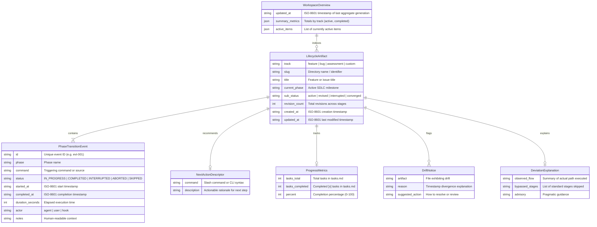
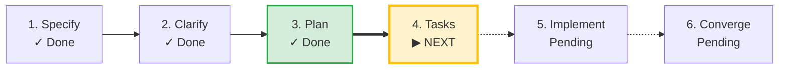

# Phase 1: Data Model & Schema Specification

**Feature**: SDLC Lifecycle State Artifact Extension (`001-sdlc-lifecycle-tracker`)
**Date**: 2026-09-02
**Status**: Completed

## 1. Core Domain Entities



---

## 2. Track & Phase Taxonomies

### Track 1: Feature SDLC (`specs/<slug>/lifecycle.md`)
- `INITIALIZING` $\rightarrow$ `SPECIFIED` (`/speckit-specify`)
- `CLARIFIED` (`/speckit-clarify` - optional)
- `CHECKLISTED` (`/speckit-checklist` - optional)
- `PLANNED` (`/speckit-plan`)
- `TASKED` (`/speckit-tasks`)
- `ISSUES_SYNCED` (`/speckit-taskstoissues` - optional)
- `ANALYZED` (`/speckit-analyze` - optional)
- `IMPLEMENTING` (`/speckit-implement`)
- `CONVERGED` (`/speckit-converge` - terminal completion)

### Track 2: Bug Triage (`.specify/bugs/<slug>/lifecycle.md`)
- `ASSESSED` (`/speckit-bug-assess`)
- `FIXED` (`/speckit-bug-fix`)
- `VERIFIED` (`/speckit-bug-test` - terminal completion)
- `ESCALATED_TO_FEATURE` (hand-off to `specs/<new-slug>/`)

### Track 3: Idea Assessment (`.specify/assessments/<slug>/lifecycle.md`)
- `INTAKE` (`/speckit-assess-intake`)
- `RESEARCHED` (`/speckit-assess-research`)
- `DEFINED` (`/speckit-assess-define`)
- `SHAPED` (`/speckit-assess-shape`)
- `DECIDED_GO` (hand-off to `specs/<new-slug>/`)
- `DECIDED_KILL` (terminal completion)

### Track 4: Open Extensible / Custom Track
- Any unknown command string (e.g. `speckit.deploy` $\rightarrow$ phase `DEPLOY`).
- Open-world assumption: never rejects or errors on custom phases.

---

## 3. Physical Storage Format (`lifecycle.md`)

`lifecycle.md` is stored inside each item's directory. It uses a **hybrid format**: structured YAML frontmatter for machine/agent parsing, followed by GitHub Flavored Markdown for human readability.

### Example `lifecycle.md`:

```markdown
---
track: feature
slug: 001-sdlc-lifecycle-tracker
title: "SDLC Lifecycle State Artifact Extension"
current_phase: PLANNED
sub_status: active
revision_count: 1
next_action:
  command: /speckit-tasks
  description: "Generate dependency-ordered tasks breakdown"
progress:
  tasks_total: 0
  tasks_completed: 0
  percent: 0
drift_advisory: null
deviation_explanation: null
created_at: "2026-09-02T21:05:00Z"
updated_at: "2026-09-02T21:52:00Z"
transitions:
  - id: evt-001
    phase: SPECIFIED
    command: speckit.specify
    status: COMPLETED
    started_at: "2026-09-02T21:05:00Z"
    completed_at: "2026-09-02T21:06:00Z"
    duration_seconds: 60
    actor: agent
    notes: "Feature specification initialized"
  - id: evt-002
    phase: PLANNED
    command: speckit.plan
    status: COMPLETED
    started_at: "2026-09-02T21:50:00Z"
    completed_at: "2026-09-02T21:52:00Z"
    duration_seconds: 120
    actor: agent
    notes: "Implementation plan & contracts generated"
---

# SDLC Lifecycle: SDLC Lifecycle State Artifact Extension

**Track**: Feature | **Current Phase**: `PLANNED` | **Status**: `ACTIVE`  
**Created**: 2026-09-02 21:05 UTC | **Last Updated**: 2026-09-02 21:52 UTC

> [!TIP]
> **Next Recommended Action**: `/speckit-tasks`  
> *Generate dependency-ordered tasks breakdown from implementation plan and contracts.*



## Milestone Timeline

| Phase | Command / Source | Status | Started | Completed | Duration | Notes |
|---|---|---|---|---|---|---|
| **Specify** | `/speckit-specify` | `COMPLETED` | 21:05:00 | 21:06:00 | 1m 0s | Feature specification initialized |
| **Plan** | `/speckit-plan` | `COMPLETED` | 21:50:00 | 21:52:00 | 2m 0s | Implementation plan & contracts generated |
```

---

## 4. Workspace Overview Format (`.specify/lifecycle-overview.md`)

```markdown
# Repository SDLC Overview

**Last Updated**: 2026-09-02 21:52 UTC

| Track | Active Items | Completed Items |
|---|---|---|
| **Features** | 1 | 0 |
| **Bugs** | 0 | 0 |
| **Assessments** | 0 | 0 |

## Active Work

| Slug | Track | Current Phase | Progress | Next Recommended Action | Last Updated |
|---|---|---|---|---|---|
| `001-sdlc-lifecycle-tracker` | Feature | `PLANNED` | 0% | `/speckit-tasks` | 2026-09-02 21:52 |
```
