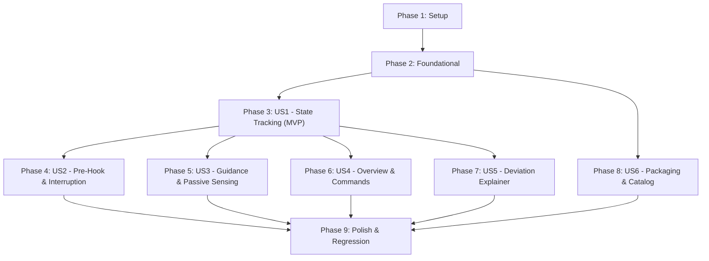

# Tasks: SDLC Lifecycle State Artifact Extension

**Feature**: SDLC Lifecycle State Artifact Extension  
**Branch**: `001-sdlc-lifecycle-tracker`  
**Input Documents**: [spec.md](./spec.md), [plan.md](./plan.md), [research.md](./research.md), [data-model.md](./data-model.md), [quickstart.md](./quickstart.md), [contracts/](./contracts/)

---

## Phase 1: Setup (Shared Infrastructure)

**Purpose**: Initialize extension directory structure, root manifest skeleton, and core scaffolding templates.

- [ ] T001 Initialize extension package directory structure (`commands/`, `scripts/`, `templates/`, `tests/contract/`, `tests/integration/`)
- [ ] T002 [P] Create initial extension manifest skeleton conforming to Spec Kit Schema 1.0 in `extension.yml`
- [ ] T003 [P] Create default lifecycle artifact scaffold in `templates/lifecycle-template.md`
- [ ] T004 [P] Create user configuration template in `config-template.yml`

---

## Phase 2: Foundational (Blocking Prerequisites)

**Purpose**: Core validation tests, YAML frontmatter engine, and path resolvers that MUST be in place before ANY user story can execute.

**⚠️ CRITICAL**: No user story work can begin until this phase is complete.

- [ ] T005 Create manifest schema contract test in `tests/contract/test_manifest_schema.py`
- [ ] T006 [P] Create lifecycle frontmatter schema contract test in `tests/contract/test_lifecycle_schema.py`
- [ ] T007 Implement YAML frontmatter parser and serializer in `scripts/lifecycle-engine.py`
- [ ] T008 Implement multi-track target directory resolver (resolving `specs/`, `.specify/bugs/`, `.specify/assessments/`) in `scripts/lifecycle-engine.py`
- [ ] T009 Implement Markdown renderer (status badges, summary card, milestone table) in `scripts/lifecycle-engine.py`

**Checkpoint**: Core engine and contract tests ready — user story implementation can now begin.

---

## Phase 3: User Story 1 - Real-Time SDLC State Tracking Across All Spec Kit Tracks (Priority: P1) 🎯 MVP

**Goal**: Maintain a dedicated living lifecycle artifact (`lifecycle.md`) in each item's directory with track metadata, active phase, ISO-8601 timestamps, and transition history across Features, Bugs, and Ideas.

**Independent Test**: Execute a feature, bug, or assessment milestone and verify `lifecycle.md` is created with valid YAML frontmatter, track tag, timestamps, and milestone table.

### Tests for User Story 1
- [ ] T010 [P] [US1] Create integration test for multi-track initialization in `tests/integration/test_multitrack_init.sh`

### Implementation for User Story 1
- [ ] T011 [US1] Implement track-specific lifecycle initializers (`feature`, `bug`, `assessment`, `custom`) in `scripts/lifecycle-engine.py`
- [ ] T012 [US1] Implement post-command hook handler in `scripts/hook-post-command.sh` to finalize completed milestones with duration and timestamps
- [ ] T013 [US1] Register `after_*` post-hooks across feature, bug, and idea tracks in `extension.yml`

**Checkpoint**: User Story 1 is fully functional and independently testable. Features, bugs, and assessments maintain living `lifecycle.md` files upon command completion.

---

## Phase 4: User Story 2 - Pre-Hook Command-Start Logging & Crash / Interruption Detection (Priority: P1)

**Goal**: Log command starts with `status: IN_PROGRESS` and detect unclosed or crashed sessions on subsequent runs, flagging `INTERRUPTED` with resumption context.

**Independent Test**: Run pre-hook, simulate process abort before post-hook, and verify the next query flags `INTERRUPTED` with start timestamp.

### Tests for User Story 2
- [ ] T014 [P] [US2] Create integration test for interruption detection and crash recovery in `tests/integration/test_interruption_detection.sh`

### Implementation for User Story 2
- [ ] T015 [US2] Implement pre-command hook handler in `scripts/hook-pre-command.sh` to record `status: IN_PROGRESS` with `started_at`
- [ ] T016 [US2] Implement unclosed `IN_PROGRESS` detection and `INTERRUPTED` status transition in `scripts/lifecycle-engine.py`
- [ ] T017 [US2] Register `before_*` pre-hooks across all supported command tracks in `extension.yml`

**Checkpoint**: User Stories 1 AND 2 are complete. Command starts are logged, durations are recorded, and interrupted sessions are surfaced immediately.

---

## Phase 5: User Story 3 - Next Step Guidance, Passive Sensing & Soft Drift (Priority: P2)

**Goal**: Provide prominent Next Recommended Action guidance, parse `tasks.md` checkbox ratios for live progress, and passively sense out-of-band edits (chat or IDE edits) via file mtimes to raise soft-drift advisories.

**Independent Test**: Touch `spec.md` after plan creation; verify `lifecycle.md` raises a soft-drift advisory and increments revision count without corrupting downstream files.

### Tests for User Story 3
- [ ] T018 [P] [US3] Create integration test for passive artifact sensing and soft drift in `tests/integration/test_passive_sensing.sh`

### Implementation for User Story 3
- [ ] T019 [US3] Implement passive artifact sensing (comparing mtimes of `spec.md`, `plan.md`, `tasks.md` against recorded completion timestamps) in `scripts/lifecycle-engine.py`
- [ ] T020 [US3] Implement `tasks.md` checkbox parser and completion percentage calculator in `scripts/lifecycle-engine.py`
- [ ] T021 [US3] Implement dynamic Next Recommended Action computation and soft drift advisory callout in `scripts/lifecycle-engine.py`

**Checkpoint**: User Story 3 is complete. Living artifacts guide users on next steps, track real-time implementation progress, and flag out-of-band edits non-destructively.

---

## Phase 6: User Story 4 - Workspace Overview & Status Commands (Priority: P2)

**Goal**: Aggregate active items into `.specify/lifecycle-overview.md` with a compact KPI summary, and expose `/speckit-lifecycle-status` and `/speckit-lifecycle-overview` CLI commands.

**Independent Test**: Run `/speckit-lifecycle-status` and `/speckit-lifecycle-overview` and confirm accurate output to stdout and `.specify/lifecycle-overview.md`.

### Tests for User Story 4
- [ ] T022 [P] [US4] Create integration test for status query and overview compilation in `tests/integration/test_status_overview.sh`

### Implementation for User Story 4
- [ ] T023 [US4] Implement workspace overview compiler generating lean active summary in `.specify/lifecycle-overview.md` in `scripts/lifecycle-engine.py`
- [ ] T024 [P] [US4] Create markdown command definition for `/speckit-lifecycle-status` in `commands/speckit.lifecycle.status.md`
- [ ] T025 [P] [US4] Create markdown command definition for `/speckit-lifecycle-overview` in `commands/speckit.lifecycle.overview.md`
- [ ] T026 [US4] Register lifecycle status and overview commands in `extension.yml`

**Checkpoint**: User Story 4 is complete. Developers and agents can inspect individual status or repository-wide dashboards on demand.

---

## Phase 7: User Story 5 - State Keeper Philosophy, Deviation Explainer & Upgrade Extensibility (Priority: P3)

**Goal**: Ensure the state machine is non-blocking (never fails or rejects on out-of-order execution), dynamically accepts unknown/upgraded Spec Kit phases, and generates plain-language Deviation Explanations.

**Independent Test**: Execute `/speckit-implement` directly after `/speckit-specify` and verify that `lifecycle.md` accepts the transition, records an Observed Deviation explanation, and suggests pragmatic next actions.

### Tests for User Story 5
- [ ] T027 [P] [US5] Create integration test for out-of-order execution and deviation explanation in `tests/integration/test_deviation_explainer.sh`

### Implementation for User Story 5
- [ ] T028 [US5] Implement open-world dynamic phase registry (accepting any unknown command without validation errors) in `scripts/lifecycle-engine.py`
- [ ] T029 [US5] Implement Deviation Explainer engine generating plain-language explanations of bypassed stages in `scripts/lifecycle-engine.py`
- [ ] T030 [US5] Add fail-closed diagnostic logging to stderr on filesystem write errors in `scripts/hook-pre-command.sh` and `scripts/hook-post-command.sh`

**Checkpoint**: User Story 5 is complete. The system acts strictly as a resilient, informative State Keeper across standard, non-standard, and future Spec Kit workflows.

---

## Phase 8: User Story 6 - Spec Kit Extension Packaging, Distribution & Catalog Publishing (Priority: P1)

**Goal**: Deliver a standalone Spec Kit extension conforming to Manifest Schema 1.0 that installs cleanly via `--dev`, release archive URL (`--from <url>`), and community catalog.

**Independent Test**: Run `specify extension add lifecycle --dev .` and verify clean validation with exit code 0; verify generated catalog submission descriptor.

### Tests for User Story 6
- [ ] T031 [P] [US6] Create integration test for `--dev` installation and archive packaging in `tests/integration/test_dev_install.sh`

### Implementation for User Story 6
- [ ] T032 [US6] Finalize root `extension.yml` manifest with complete command, hook, and template declarations conforming to Schema 1.0
- [ ] T033 [P] [US6] Create comprehensive extension documentation in `README.md`
- [ ] T034 [P] [US6] Create `LICENSE` (MIT) and release notes in `CHANGELOG.md`
- [ ] T035 [US6] Generate community catalog submission descriptor in `catalog-submission.json` conforming to the `extensions/catalog.community.json` schema

**Checkpoint**: User Story 6 is complete. Extension is packaged, installable, and ready for global distribution.

---

## Phase 9: Polish & Cross-Cutting Concerns

**Purpose**: End-to-end regression validation, execution permissions, and documentation validation.

- [ ] T036 [P] Create full regression test suite orchestrator in `tests/run_all_tests.sh`
- [ ] T037 Validate end-to-end quickstart workflow against `specs/001-sdlc-lifecycle-tracker/quickstart.md`
- [ ] T038 [P] Configure executable permissions (`chmod +x`) on all shell scripts in `scripts/` and `tests/`

---

## Dependencies & Execution Order

### Phase Dependencies

- **Setup (Phase 1)**: No dependencies — start immediately.
- **Foundational (Phase 2)**: Depends on Phase 1 — **BLOCKS** all user story phases.
- **User Story 1 (Phase 3 - P1 MVP)**: Depends on Phase 2. Core tracking and living artifact rendering.
- **User Story 2 (Phase 4 - P1)**: Depends on Phase 2 & 3. Command-start logging & interruption recovery.
- **User Story 3 (Phase 5 - P2)**: Depends on Phase 2 & 3. Next step guidance & passive sensing.
- **User Story 4 (Phase 6 - P2)**: Depends on Phase 2 & 3. Overview compiler & CLI commands.
- **User Story 5 (Phase 7 - P3)**: Depends on Phase 2 & 3. Deviation explainer & open phase registry.
- **User Story 6 (Phase 8 - P1)**: Can proceed alongside User Stories; finalizes packaging, manifest, and catalog submission.
- **Polish (Phase 9)**: Depends on completion of all desired user stories.

---

## Parallel Opportunities

- **Phase 1**: `T002`, `T003`, `T004` can execute in parallel.
- **Phase 2**: `T006` contract test can be written in parallel with `T005`.
- **Phase 3 (US1)**: Test `T010` can be written in parallel with initial engine work.
- **Phase 4 (US2)**: Test `T014` can run in parallel with pre-hook script creation.
- **Phase 5 (US3)**: Test `T018` can run in parallel with passive sensing engine work.
- **Phase 6 (US4)**: Command definitions `T024` and `T025` can be authored in parallel.
- **Phase 8 (US6)**: `README.md` (`T033`), `LICENSE`/`CHANGELOG.md` (`T034`), and test `T031` can run in parallel.
- **Phase 9**: `T036` and `T038` can run in parallel.

---

## Implementation Strategy

### MVP First (User Story 1 Only)
1. Complete **Phase 1: Setup**
2. Complete **Phase 2: Foundational**
3. Complete **Phase 3: User Story 1**
4. **STOP and VALIDATE**: Test `lifecycle.md` creation and post-hook updates on a sample feature.
5. Deploy/verify MVP functionality.

### Incremental Delivery
1. Foundation + US1 $\rightarrow$ Basic state tracking functional (MVP).
2. Add US2 $\rightarrow$ Crash & interruption detection activated.
3. Add US3 $\rightarrow$ Next action guidance and passive out-of-band sensing activated.
4. Add US4 $\rightarrow$ Global workspace overview and CLI commands available.
5. Add US5 $\rightarrow$ Deviation explainer and upgrade extensibility active.
6. Add US6 $\rightarrow$ Standalone Spec Kit extension packaging and community catalog submission ready.
