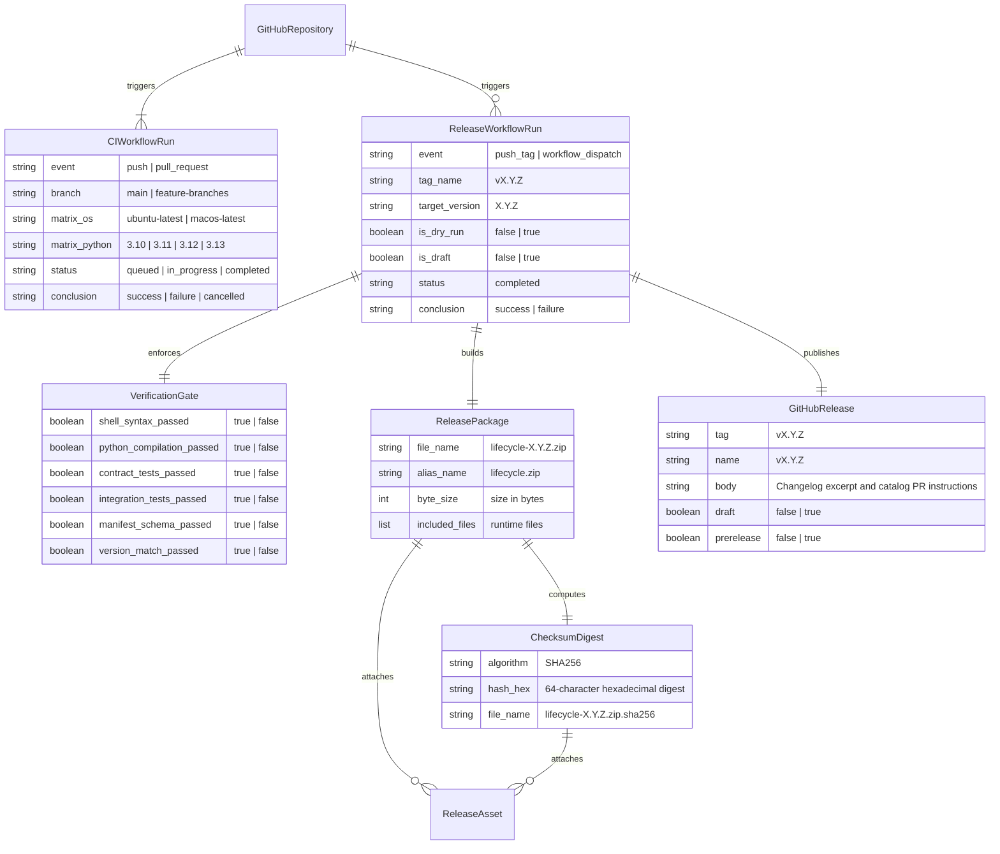
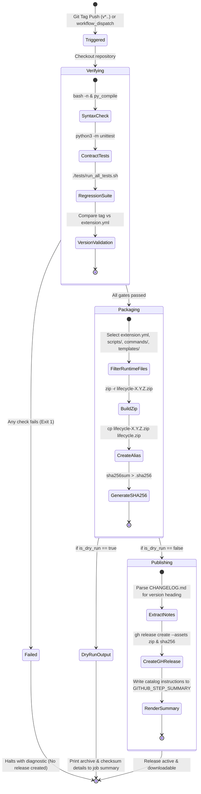

# Phase 1: Data Model & Workflow Schema Specification

**Feature**: `002-github-ci-release`  
**Date**: 2026-09-03  
**Status**: Completed  

---

## 1. Domain Entities & Relationships

---

## 2. Release State Machine & Lifecycle Transitions

---

## 3. Package File Inclusion Matrix

| Path / Pattern | Included in Release Archive? | Justification |
|---|:---:|---|
| `extension.yml` | **YES** | Core Spec Kit Extension manifest |
| `catalog-submission.json` | **YES** | Pre-formatted catalog submission descriptor |
| `config-template.yml` | **YES** | User configuration template |
| `README.md` | **YES** | User and agent documentation |
| `LICENSE` | **YES** | Legal MIT license terms |
| `CHANGELOG.md` | **YES** | Release notes and version history |
| `commands/**` | **YES** | Spec Kit command descriptors |
| `scripts/**` | **YES** | Core runtime engine and bash hook wrappers |
| `templates/**` | **YES** | Lifecycle markdown templates |
| `tests/**` | **NO** | Test suites are dev-only; not needed by end-user projects |
| `specs/**` | **NO** | Spec Kit specs are repo-internal; not distributed |
| `.github/**` | **NO** | GitHub workflows are repo-internal |
| `.git/**` | **NO** | VCS metadata strictly excluded |
| `__pycache__/**` | **NO** | Python runtime bytecode strictly excluded |
| `.DS_Store` | **NO** | OS metadata strictly excluded |
