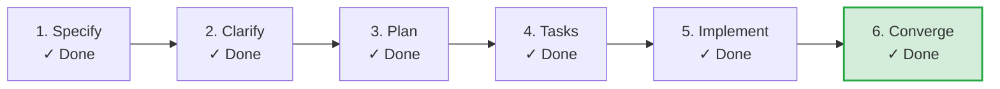

# SDLC Lifecycle: GitHub CI & Native Release Automation

**Track**: Feature | **Current Phase**: `CONVERGED` | **Status**: `CONVERGED`  
**Created**: 2026-09-03 11:18 UTC | **Last Updated**: 2026-09-03 16:52 UTC

**Task Progress**: 100% (15/15 tasks completed)

> [!TIP]
> **Next Recommended Action**: `Complete`  
> *Feature lifecycle converged and verified*

## Milestone Timeline

| Phase | Command / Source | Status | Started | Completed | Duration | Notes |
|---|---|---|---|---|---|---|
| **Specify** | `/speckit-specify` | `COMPLETED` | 11:18:26 | 11:19:26 | 1m 0s | Feature specification verified from spec.md |
| **Checklists** | `/speckit-checklist` | `COMPLETED` | 11:19:27 | 11:20:26 | 59s | Quality checklists verified from checklists/ |
| **Plan** | `/speckit-plan` | `COMPLETED` | 12:53:35 | 12:53:35 | 0s | Plan milestone completed |
| **Tasks** | `/speckit-tasks` | `COMPLETED` | 15:16:00 | 15:16:00 | 0s | Tasks milestone completed |
| **Tasks** | `/speckit-tasks` | `COMPLETED` | 16:03:04 | 16:03:04 | 0s | Tasks milestone completed |
| **Implement** | `/speckit-implement` | `COMPLETED` | 16:49:24 | 16:49:24 | 0s | Implement milestone completed |
| **Converge** | `/speckit-converge` | `COMPLETED` | 16:52:15 | 16:52:15 | 0s | Converge milestone completed |
