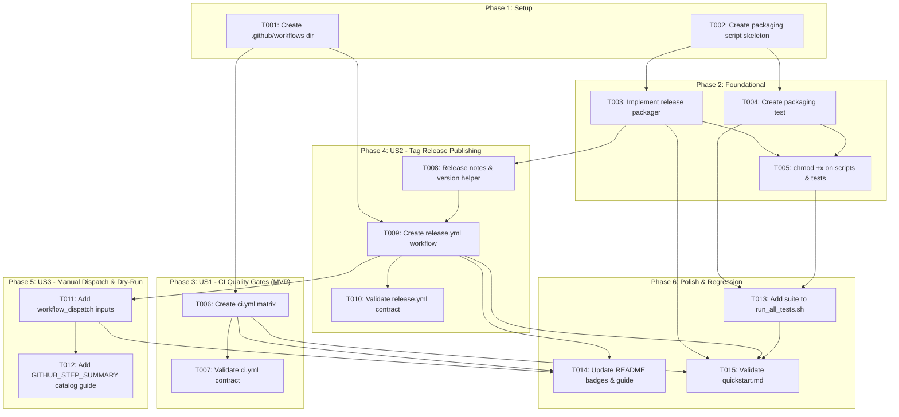

# Tasks: GitHub CI & Native Release Automation

**Feature**: GitHub CI & Native Release Automation  
**Branch**: `002-github-ci-release`  
**Input Documents**: [spec.md](./spec.md), [plan.md](./plan.md), [research.md](./research.md), [data-model.md](./data-model.md), [quickstart.md](./quickstart.md), [contracts/](./contracts/)

---

## Phase 1: Setup (Shared Infrastructure)

**Purpose**: Initialize workflow directories and packaging script skeletons.

- [x] T001 Create `.github/workflows` directory structure
- [x] T002 [P] Create packaging script skeleton in `scripts/package-release.sh`

---

## Phase 2: Foundational (Blocking Prerequisites)

**Purpose**: Portable release packaging script and package verification tests that MUST be in place before release workflows can execute.

**⚠️ CRITICAL**: No release workflow work can begin until this phase is complete.

- [x] T003 Implement portable release archive packager in `scripts/package-release.sh` (depends on T002)
- [x] T004 [P] Create integration test for packaging script in `tests/integration/test_release_packaging.sh` (depends on T002)
- [x] T005 Configure executable permissions (`chmod +x`) on `scripts/package-release.sh` and `tests/integration/test_release_packaging.sh` (depends on T003, T004)

**Checkpoint**: Packaging script builds clean zip archives and computes SHA256 checksums — workflow implementation can now begin.

---

## Phase 3: User Story 1 - Automated Continuous Integration & Multi-Platform Quality Gates (Priority: P1) 🎯 MVP

**Goal**: Establish an automated GitHub Actions CI workflow executing multi-OS test matrix (Ubuntu & macOS, Python 3.10–3.13), static analysis (`bash -n`, `py_compile`), and the complete 8-suite regression runner on every PR and push to `main`.

**Independent Test**: Trigger workflow on PR or push; verify `bash -n`, `py_compile`, contract tests, and `./tests/run_all_tests.sh` pass cleanly on Linux and macOS runners within 3 minutes.

### Implementation for User Story 1
- [x] T006 [P] [US1] Create CI workflow definition with multi-OS runner matrix in `.github/workflows/ci.yml` (depends on T001)
- [x] T007 [US1] Validate CI workflow YAML syntax and contract conformance in `tests/contract/test_ci_workflow.py` (depends on T006)

**Checkpoint**: User Story 1 is fully functional. PRs and main pushes are automatically gated across Linux and macOS.

---

## Phase 4: User Story 2 - Native Tag-Triggered GitHub Release Publishing (Priority: P1)

**Goal**: Establish tag-triggered (`v*.*.*`) release workflow that gates on CI verification, packages clean distribution `.zip` and SHA256 checksums, extracts changelog notes, and publishes a GitHub Release using native GitHub CLI (`gh release create`).

**Independent Test**: Push tag `v*.*.*`; observe workflow run verification gate, package clean archive without dev files, extract release notes, and publish GitHub Release with attached assets.

### Implementation for User Story 2
- [x] T008 [P] [US2] Implement release notes extraction (`release-notes <VERSION>`) and version alignment (`verify-version <VERSION>`) subcommands in `scripts/lifecycle-engine.py` (depends on T003)
- [x] T009 [US2] Create tag-triggered release workflow in `.github/workflows/release.yml` (depends on T001, T003, T008)
- [x] T010 [US2] Validate release workflow YAML syntax and contract conformance in `tests/contract/test_release_workflow.py` (depends on T009)

**Checkpoint**: User Story 2 is complete. Pushing a Git tag automatically produces a verified GitHub Release with distribution assets.

---

## Phase 5: User Story 3 - Manual Release Dispatch & Validation Dry-Run (Priority: P2)

**Goal**: Support manual `workflow_dispatch` with configurable `version`, `dry_run: true`, and `draft: true` inputs, outputting asset metadata and catalog PR instructions to `$GITHUB_STEP_SUMMARY`.

**Independent Test**: Run workflow dispatch with `dry_run: true`; verify archive and checksums are built and summary is rendered without creating a public release.

### Implementation for User Story 3
- [x] T011 [US3] Add `workflow_dispatch` trigger with version, dry_run, and draft inputs to `.github/workflows/release.yml` (depends on T009)
- [x] T012 [US3] Add `$GITHUB_STEP_SUMMARY` formatting with release status, SHA256 hashes, and community catalog PR instructions in `.github/workflows/release.yml` (depends on T011)

**Checkpoint**: User Story 3 is complete. Maintainers can test releases safely via dry-run and inspect generated community catalog metadata.

---

## Phase 6: Polish & Cross-Cutting Concerns

**Purpose**: Test suite integration, documentation, and end-to-end quickstart validation.

- [x] T013 Integrate `test_release_packaging.sh` into `tests/run_all_tests.sh` (depends on T004, T005)
- [x] T014 [P] Update `README.md` with CI badges and GitHub Actions release guide (depends on T006, T009, T011)
- [x] T015 Validate end-to-end local pre-flight and dry-run workflow against `specs/002-github-ci-release/quickstart.md` (depends on T003, T006, T009, T013)

---

## Dependencies & Execution Order

### Phase Dependencies

- **Setup (Phase 1)**: No dependencies — can start immediately.
- **Foundational (Phase 2)**: Depends on Setup completion — **BLOCKS** release workflows.
- **User Story 1 (Phase 3 - P1 MVP)**: Depends on Phase 1 (`T001`). Can proceed independently of packaging script.
- **User Story 2 (Phase 4 - P1)**: Depends on Phase 1 (`T001`) and Phase 2 (`T003`, `T005`).
- **User Story 3 (Phase 5 - P2)**: Depends on User Story 2 (`T009`).
- **Polish (Phase 6)**: Depends on completion of User Stories 1, 2, and 3.

### Task-Level Dependency Mapping

| Task ID | Task Description | Explicit Prerequisites | Blocks |
|---|---|---|---|
| `T001` | Create `.github/workflows` directory structure | None | `T006`, `T009` |
| `T002` | Create packaging script skeleton | None | `T003`, `T004` |
| `T003` | Implement portable release packager | `T002` | `T005`, `T008`, `T009`, `T015` |
| `T004` | Create packaging integration test | `T002` | `T005`, `T013` |
| `T005` | Configure executable permissions (`chmod +x`) | `T003`, `T004` | `T013` |
| `T006` | Create CI workflow definition | `T001` | `T007`, `T014`, `T015` |
| `T007` | Validate CI workflow YAML syntax | `T006` | None |
| `T008` | Implement `release-notes` & `verify-version` subcommands in `scripts/lifecycle-engine.py` | `T003` | `T009` |
| `T009` | Create tag release workflow | `T001`, `T003`, `T008` | `T010`, `T011`, `T014`, `T015` |
| `T010` | Validate release workflow YAML syntax | `T009` | None |
| `T011` | Add `workflow_dispatch` trigger | `T009` | `T012`, `T014` |
| `T012` | Add `$GITHUB_STEP_SUMMARY` catalog instructions | `T011` | None |
| `T013` | Integrate `test_release_packaging.sh` into `run_all_tests.sh` | `T004`, `T005` | `T015` |
| `T014` | Update `README.md` with CI badges & release guide | `T006`, `T009`, `T011` | None |
| `T015` | Validate end-to-end quickstart workflow | `T003`, `T006`, `T009`, `T013` | None |

### Dependency Graph

---

## Parallel Opportunities

- **Phase 1**: `T001` and `T002` can execute in parallel.
- **Phase 2**: `T004` (test creation) can be authored in parallel with `T003` (packager implementation).
- **Phase 3 (US1)**: `T006` can proceed in parallel with Foundational work (`T003`–`T005`) as CI does not depend on the release packaging script.
- **Phase 4 (US2)**: `T008` (notes helper) and `T009` (workflow scaffold) can be prepared in parallel.
- **Phase 6**: `T014` (README documentation) can execute in parallel with `T013` (test suite orchestration).

---

## Implementation Strategy

### MVP First (User Story 1 Only)
1. Complete **Phase 1: Setup** (`T001`, `T002`).
2. Complete **Phase 3: User Story 1** (`T006`, `T007`).
3. **STOP and VALIDATE**: Verify `.github/workflows/ci.yml` validates and runs cleanly.
4. Merge MVP CI to protect `main` branch immediately.

### Incremental Delivery
1. Foundation + US1 $\rightarrow$ Automated CI quality gates active on PRs and `main`.
2. Add US2 $\rightarrow$ Tag-triggered automated release packaging and publishing active.
3. Add US3 $\rightarrow$ Manual dispatch dry-run and community catalog summary active.
4. Polish $\rightarrow$ Regression suite updated, README updated, quickstart validated.
