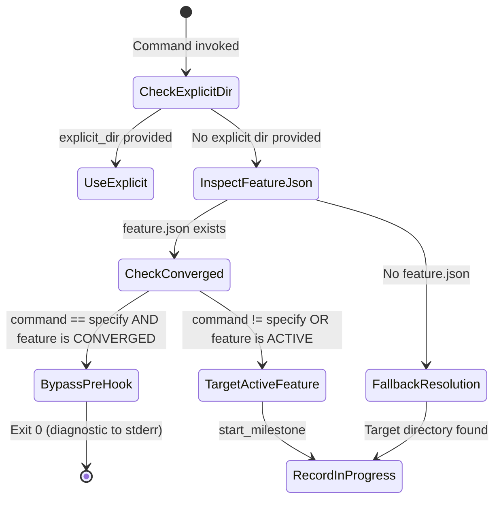
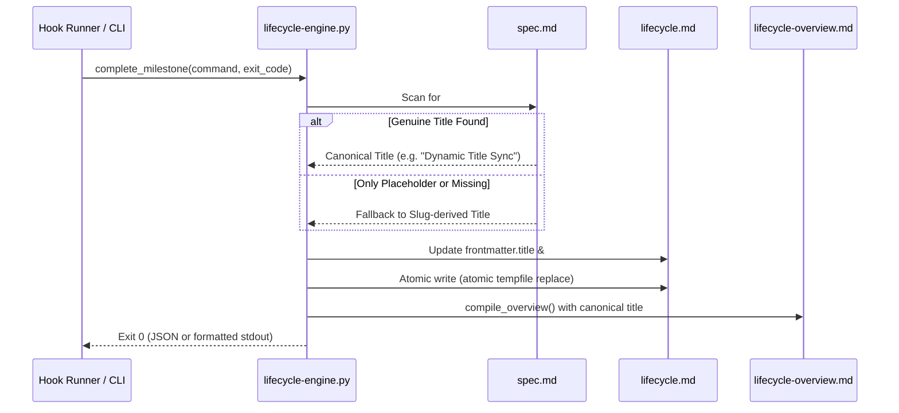

# Data Model: Lifecycle Title Resolution & Pre-Hook Spec Bootstrapping

**Feature**: `003-lifecycle-title-resolution`  
**Date**: 2026-09-04  

## Entities

### 1. TitleCandidate
Represents a candidate string evaluated for suitability as the canonical human-readable title.

| Field | Type | Description |
|---|---|---|
| `raw_text` | `str` | Raw string parsed from markdown heading or frontmatter |
| `normalized` | `str` | Trimmed string stripped of surrounding quotes or brackets |
| `source` | `Enum` | `SPEC_HEADER`, `REPORT_HEADER`, `INTAKE_HEADER`, `LIFECYCLE_FM`, `SLUG_INFERRED` |
| `is_placeholder` | `bool` | `True` if candidate matches known template tokens (`FEATURE NAME`, `UNTITLED`, etc.) |
| `is_valid` | `bool` | `True` if non-empty and `not is_placeholder` |

#### Placeholder Tokens
Candidates matching the following normalized tokens (case-insensitive) are flagged as placeholders:
- `FEATURE NAME`, `FEATURE_NAME`
- `FEATURE TITLE`, `FEATURE_TITLE`
- `UNTITLED`
- `FEATURE`
- `TITLE`

---

### 2. LifecycleFrontmatter (Title Fields)
Schema representation of the title attribute within `lifecycle.md` YAML frontmatter.

| Field | Type | Required | Constraints / Validation |
|---|---|---|---|
| `title` | `str` | Yes | Non-empty string. Conforms to `lifecycle.schema.json`. |
| `slug` | `str` | Yes | Kebab-case directory identifier (e.g. `003-lifecycle-title-resolution`). |
| `track` | `str` | Yes | `feature`, `bug`, `assessment`, `custom`. |
| `updated_at` | `str` | Yes | ISO-8601 UTC timestamp updated whenever title or transitions change. |

---

### 3. PreHookTargetResolutionContext
Context evaluated by `resolve_target_dir` during pre-hook execution (`start_milestone`).

---

### 4. PostHookTitleSyncFlow
Synchronization workflow executed within `complete_milestone`.

---

## State Transition Rules

1. **Scaffold / Init Phase**:
   - If initialized before `spec.md` exists or while `spec.md` contains placeholders, `title` is set to humanized `slug`.
2. **Specify Completion Phase**:
   - Upon `complete_milestone("specify", exit_code)`:
     - `spec.md` title is parsed.
     - If valid, `title` replaces the provisional slug or placeholder.
     - `updated_at` is stamped with the completion timestamp.
3. **Downstream Milestone Re-Sync**:
   - Upon `complete_milestone(cmd)` for `clarify`, `plan`, `tasks`, etc.:
     - Re-infer title. If author updated title in `spec.md`, synchronize in-place.
     - Do NOT increment `revision_count` or generate soft-drift advisories for title-only changes.
4. **Passive Sensing / Overview**:
   - `sense` and `overview` commands reflect the canonical title dynamically.
