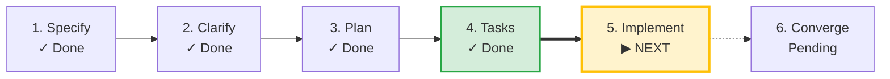

# SDLC Lifecycle: [FEATURE NAME]

**Track**: Feature | **Current Phase**: `TASKED` | **Status**: `ACTIVE`  
**Created**: 2026-09-04 16:04 UTC | **Last Updated**: 2026-09-04 16:17 UTC

**Task Progress**: 0% (0/20 tasks completed)

> [!TIP]
> **Next Recommended Action**: `/speckit-implement`  
> *Execute implementation tasks*

## Milestone Timeline

| Phase | Command / Source | Status | Started | Completed | Duration | Notes |
|---|---|---|---|---|---|---|
| **Specify** | `/speckit-specify` | `COMPLETED` | 16:04:12 | 16:05:12 | 1m 0s | Feature specification verified from spec.md |
| **Specify** | `/speckit-specify` | `COMPLETED` | 16:05:14 | 16:08:08 | 2m 54s | Specify milestone completed |
| **Plan** | `/speckit-plan` | `COMPLETED` | 16:15:27 | 16:16:13 | 46s | Plan milestone completed |
| **Tasks** | `/speckit-tasks` | `COMPLETED` | 16:17:25 | 16:17:51 | 26s | Tasks milestone completed |
