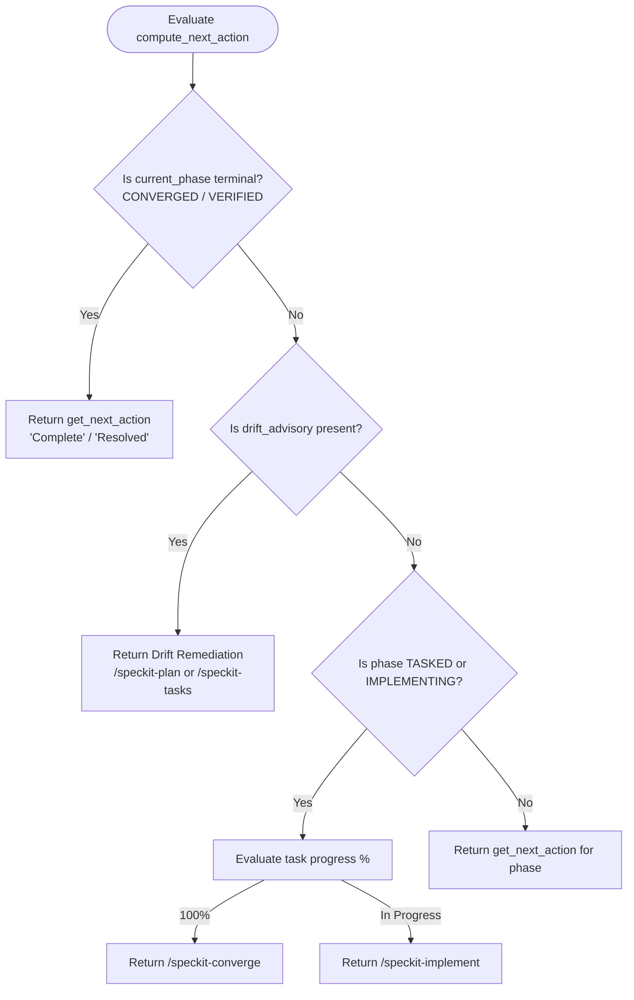

# Data Model: Artifact Drift Mtime Detection & Phase Latch Prevention

**Feature**: `004-artifact-drift-mtime`  
**Date**: 2026-09-04  
**Status**: Completed  

---

## Entities

### 1. ArtifactPairComparison
Represents the pairwise comparison of modification timestamps between adjacent SDLC specification artifacts.

| Field | Type | Description |
|---|---|---|
| `upstream_file` | `Path` | The upstream artifact file (e.g., `spec.md` or `plan.md`). |
| `downstream_file` | `Path` | The downstream artifact file (e.g., `plan.md` or `tasks.md`). |
| `upstream_mtime` | `float` | POSIX timestamp of `upstream_file` modification. |
| `downstream_mtime` | `float` | POSIX timestamp of `downstream_file` modification. |
| `delta_seconds` | `float` | `upstream_mtime - downstream_mtime`. |
| `buffer_threshold` | `float` | Constant threshold (`1.0s`) mitigating clock jitter and sub-second truncation. |
| `has_drift` | `bool` | Evaluates to `True` if `delta_seconds >= buffer_threshold`. |
| `advisory` | `str | None` | Descriptive notification string if `has_drift` is `True`, otherwise `None`. |

#### Pairwise Rules

| Pair | Condition for Drift | Advisory Message | Remediation Action |
|---|---|---|---|
| `spec.md` vs `plan.md` | `mtime(spec) - mtime(plan) >= 1.0` | `"spec.md was modified after plan.md was generated. Review plan or run /speckit-plan."` | `/speckit-plan` |
| `plan.md` vs `tasks.md` | `mtime(plan) - mtime(tasks) >= 1.0` | `"plan.md was modified after tasks.md was generated. Review tasks or run /speckit-tasks."` | `/speckit-tasks` |

---

### 2. LifecycleFrontmatter (Drift & Action Attributes)
Schema representation of the drift tracking attributes within `lifecycle.md` YAML frontmatter conforming to `lifecycle.schema.json`.

| Field | Type | Required | Constraints / Validation |
|---|---|---|---|
| `drift_advisory` | `str | None` | Yes (nullable) | Non-empty string when drift is detected; `null` when artifacts are consistent. |
| `revision_count` | `int` | Yes | Non-negative integer. Incremented by 1 upon entering a new drift condition. |
| `next_action` | `dict` | Yes | Object containing `command` and `description` strings. |
| `current_phase` | `str` | Yes | Standard phase enum string (e.g. `SPECIFIED`, `PLANNED`, `TASKED`, `CONVERGED`). |
| `sub_status` | `str` | Yes | Status enum string (`active`, `converged`, `interrupted`, `bypassed`). |

---

## State Transitions & Flows

### Drift Lifecycle State Machine

```mermaid
stateDiagram-v2
    [*] --> InSync: Artifacts generated in sequence
    InSync --> InSync: Downstream artifact edited out-of-band (mtime downstream >= upstream)
    InSync --> DriftDetected: Upstream artifact edited (mtime upstream - downstream >= 1.0s)
    DriftDetected --> DriftDetected: Repeated checks (idempotent; revision_count unchanged)
    DriftDetected --> InSync: Downstream artifact updated/regenerated (drift_advisory cleared to null)
```

- **`InSync`**: `drift_advisory == null`.
- **`DriftDetected`**: `drift_advisory != null`. `revision_count` incremented by 1 on transition.
- **`DriftResolved`**: `drift_advisory` set to `null`. `revision_count` is preserved.

---

### Next Action Resolution Flow

