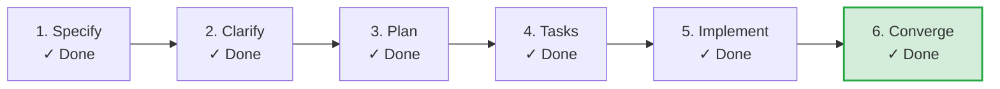

# SDLC Lifecycle: Artifact Drift File Mtime Detection & Phase Latch Prevention

**Track**: Feature | **Current Phase**: `CONVERGED` | **Status**: `CONVERGED`  
**Created**: 2026-09-04 22:00 UTC | **Last Updated**: 2026-09-04 22:30 UTC

**Task Progress**: 100% (15/15 tasks completed)

> [!TIP]
> **Next Recommended Action**: `Complete`  
> *Feature lifecycle converged and verified*

## Milestone Timeline

| Phase | Command / Source | Status | Started | Completed | Duration | Notes |
|---|---|---|---|---|---|---|
| **Specify** | `/speckit-specify` | `COMPLETED` | 22:00:38 | 22:01:38 | 1m 0s | Feature specification verified from spec.md |
| **Checklists** | `/speckit-checklist` | `COMPLETED` | 22:01:39 | 22:02:38 | 59s | Quality checklists verified from checklists/ |
| **Specify** | `/speckit-specify` | `COMPLETED` | 22:01:44 | 22:01:44 | 0s | Specify milestone completed |
| **Plan** | `/speckit-plan` | `COMPLETED` | 22:10:00 | 22:11:32 | 1m 32s | Plan milestone completed |
| **Tasks** | `/speckit-tasks` | `COMPLETED` | 22:21:00 | 22:21:18 | 18s | Tasks milestone completed |
| **Analyze** | `/speckit-analyze` | `COMPLETED` | 22:22:45 | 22:22:53 | 8s | Analyze milestone completed |
| **Implement** | `/speckit-implement` | `COMPLETED` | 22:23:21 | 22:26:16 | 2m 55s | Implement milestone completed |
| **Converge** | `/speckit-converge` | `COMPLETED` | 22:30:34 | 22:30:39 | 5s | Converge milestone completed |
