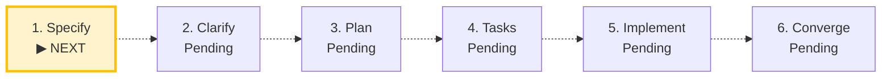

# SDLC Lifecycle: [FEATURE_TITLE]

**Track**: Feature | **Current Phase**: `INITIALIZING` | **Status**: `ACTIVE`  
**Created**: [CREATED_AT] | **Last Updated**: [UPDATED_AT]

> [!TIP]
> **Next Recommended Action**: `/speckit-specify`  
> *Define user scenarios, functional requirements, and success criteria.*

## Milestone Timeline

| Phase | Command / Source | Status | Started | Completed | Duration | Notes |
|---|---|---|---|---|---|---|
